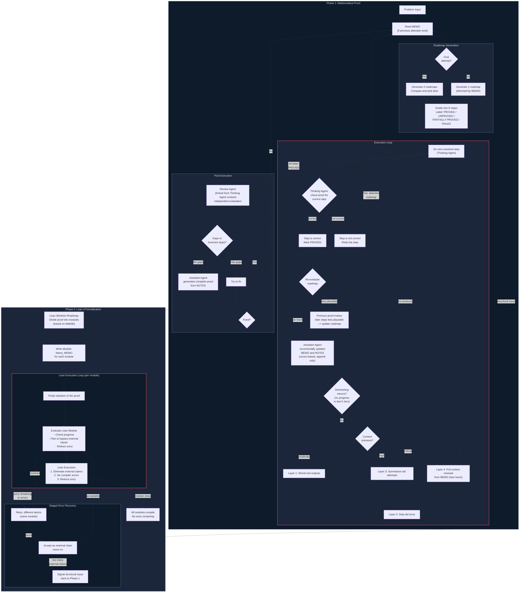

# Math Agent -- Architecture

A depth-first, MEMO-driven math proof agent with Lean 4 verification.

---

## 1. Design Principles

1. **Depth-first, not breadth-first.** Commit to one roadmap, try it seriously,
   learn from concrete failures, then pivot with knowledge.
2. **The proof attempt is the evaluation.** No heuristic scoring. The Lean
   compiler and unresolved sorry's are ground truth.
3. **MEMO as persistent memory.** Structured documents survive context resets
   and carry forward what was tried, what failed, what was proved.
4. **Math first, Lean second.** Prove mathematically, then formalize. Two
   distinct phases with different agent roles and models.
5. **External claims are allowed.** Well-known textbook results can be accepted
   as axioms in the Lean phase. Focus on verifying novel logic.
6. **Trust the frontier model.** No micromanaged tactic strategies. If the
   model can't prove it, ordering won't help.
7. **Progressive compression, not hard resets.** Context is compressed in
   stages; full renewal is a last resort, not the default.
8. **Incremental updates, not rewrites.** MEMO is updated by appending
   new results, not by re-summarizing the entire history each time.

---

## 2. Agents

| Agent | Role | Execution model | When active |
|-------|------|-----------------|-------------|
| **Thinking Agent** | Execute proof reasoning. Research the problem, generate roadmaps, work through and verify proof steps. | Main worker (long-running, stateful) | Phase 1 (math proof) |
| **Assistant Agent** | Organize NOTES and MEMO. Incrementally update documents after each step -- never re-summarize, only append new results. | Background, triggered at step boundaries | After each step completes |
| **Review Agent** | Independent correctness check. Forks from Thinking Agent context (sees everything, runs independently). Statistical accuracy boost, not a guarantee. | Forked from Thinking Agent | After roadmap completes |
| **CLI Agent** | Write and debug Lean 4 code. Module-level skeleton, sorry-elimination, compiler interaction. | Separate process with Lean toolchain | Phase 2 (Lean formalization) |

### Agent design notes

**Review Agent forks, not restarts.** The Review Agent inherits the Thinking
Agent's full context but runs an independent evaluation pass. This is stronger
than starting blind (it can see the actual work) but still independent (separate
execution, no shared momentum). Inspired by Claude Code's "perfect fork" pattern
where sub-agents fork with shared prompt cache.

**Assistant Agent is cursor-based.** After step 3 completes, the Assistant Agent
only processes step 3's results -- it does not re-read and re-summarize steps 1
and 2. This prevents MEMO drift where re-summarization gradually loses details.
Inspired by Claude Code's `lastMemoryMessageUuid` incremental processing.

---

## 3. Documents

### MEMO (compressed research state)

The brief research notes that survive context resets. Maintained by the
Assistant Agent in a structured format. Updated incrementally (append-only
at step boundaries, never full rewrite).

```markdown
## Current Roadmap
Step 1: [description] .................. [PROVED]
Step 2: [description] .................. [PARTIALLY PROVED]
Step 3: [description] .................. [UNPROVED]
Step 4: [description] .................. [FAILED -- reason: ...]

## Proved Propositions (reusable across roadmaps)
- P1: [statement] ...................... (proved in Roadmap A, step 2)
- P2: [statement] ...................... (proved in Roadmap B, step 1)
- P3: [statement] ...................... (proved in current roadmap, step 1)

## Previous Roadmaps
### Roadmap A (abandoned, round 3)
Approach: [brief description]
Failed because: [specific reason]
Achieved: P1, P2 (see Proved Propositions)
Key lesson: [what to avoid]

### Roadmap B (abandoned, round 7)
Approach: [brief description]
Failed because: [specific reason]
Achieved: P3 (see Proved Propositions)
Key lesson: [what to avoid]
```

Key rules:
- Keep MEMO condensed but ensure all useful information is preserved
- **Always include proved propositions** -- they may be reusable in the next roadmap
- Previous roadmaps record what was achieved (proved propositions), not just why they failed
- Successful steps recorded in detail; failed steps recorded briefly with reason

### NOTES (detailed proof record)

The full detailed proof of successful attempts. Read by the Thinking Agent
only when necessary (e.g., to reuse a proved proposition in a new roadmap).

### [Module-Name]_MEMO (per-Lean-module state)

During Phase 2, each Lean module has its own MEMO tracking:
- The module's roadmap
- External claims to eliminate
- Sorry's remaining
- Compiler errors encountered

---

## 4. Hyperparameters

| Parameter | Meaning |
|-----------|---------|
| **N** | Number of steps per roadmap |
| **C** | Context compression interval: after C execution loops, trigger progressive compression |

Note: there is no fixed **M** (max rounds per roadmap). Instead, the system uses
**diminishing-returns detection**: if the Thinking Agent makes no progress over
the last K iterations (no new steps PROVED, no new insights in MEMO), the roadmap
is abandoned. This is adaptive rather than a fixed budget.

---

## 5. Architecture Diagram



---

## 6. Phase 1: Mathematical Proof (detail)

### 6.1 Roadmap Generation

**First attempt (no MEMO exists):**
The Thinking Agent researches the problem and generates **3 plausible roadmaps**.
It compares them and selects the most concretely executable one (not the most
impressive-sounding one). The selected roadmap is divided into N steps, each
labeled UNPROVED. Generating 3 forces the model to think broadly before
committing -- producing a single roadmap leads to less exploration of the
proof space.

**Subsequent attempts (MEMO exists):**
The Thinking Agent reads MEMO first -- learning what approaches were tried,
why they failed, and what propositions were proved. It generates **1 roadmap**
informed by this history. Generating 3 again would waste effort; the MEMO
already provides the breadth of exploration.

The Assistant Agent records the chosen roadmap and reasoning in MEMO.

### 6.2 Execution Loop

For each unsolved step in the roadmap:

1. **Thinking Agent works the step** -- reasons through the proof in detail
2. **Thinking Agent verifies the step** -- checks whether the proof for the
   current step is correct:
   - **Correct** --> mark step PROVED, proceed to re-evaluate the roadmap
   - **Not correct** --> redo the step (do not advance)
3. **Re-evaluate the roadmap** after each proved step:
   - If the proved step keeps the roadmap on track --> continue to next step
   - If the proved step makes later steps less plausible --> update the
     roadmap (modify future steps, not restart from scratch)
   - If a step fails outright after multiple redos --> mark FAILED, record why
4. **Assistant Agent incrementally updates MEMO and NOTES:**
   - MEMO gets the new status label + brief result (append, not rewrite)
   - NOTES gets the detailed proof of any newly proved steps
5. **Diminishing-returns check:** if no progress in the last K iterations
   (no new steps PROVED, no new insights), abandon the roadmap and return
   to Roadmap Generation with updated MEMO.

### 6.3 Progressive Context Compression

Instead of a hard context reset every C iterations, context is managed in
stages (inspired by Claude Code's 5-layer compression pipeline):

| Layer | Action | When |
|-------|--------|------|
| **Layer 1** | Shrink large tool outputs and verbose reasoning | Context > 60% capacity |
| **Layer 2** | Snip old turns (early failed attempts) | Context > 75% capacity |
| **Layer 3** | Summarize old proof attempts into MEMO-style entries | Context > 85% capacity |
| **Layer 4** | Full context renewal: start fresh, read MEMO to resume | Context > 95% capacity (last resort) |

Each layer only triggers when the previous one is insufficient. This preserves
more nuance from the current session than a hard reset.

### 6.4 Review

The Review Agent **forks from the Thinking Agent's context** -- it inherits
everything the Thinking Agent knows but runs an independent evaluation. This
is stronger than a blind fresh-context review (it can see the actual work)
but still independent (separate execution thread, no shared momentum).

This is **not a guarantee of correctness** -- it is a statistical accuracy
boost. After tens of loops, the Thinking Agent may have accumulated blind
spots. The Review Agent catches obvious drift before entering the expensive
Lean phase.

- No gaps found --> Assistant Agent compiles complete proof from NOTES
- Gaps found --> attempt to fix
  - Fixable --> fix and re-review
  - Unfixable --> abandon, update MEMO (recording what was achieved), generate
    new roadmap

---

## 7. Phase 2: Lean 4 Formalization (detail)

### 7.1 Lean Skeleton

Based on Mathlib, divide the proof into modules. Each module is one logical
unit (one lemma, one construction, one key step). For each module, write a
`[Module-Name]_MEMO` containing the module's roadmap.

### 7.2 Lean Execution (per module)

For each module:

1. **Finish the skeleton** -- write the full type signature, imports,
   and sorry-placeholder proof body
2. **Evaluate** -- check current progress, plan how to:
   - Overcome or bypass external inputs (things not in Mathlib)
   - Reduce sorry count
   - Update `[Module-Name]_MEMO`
3. **Execute** -- the CLI Agent works in this order:
   - First: eliminate external claims and ensure no compiler errors
   - Then: reduce sorry's
4. **Loop** until the module compiles with no sorry remaining

### 7.3 External Claims

Well-known textbook results that are not in Mathlib can be accepted as
**external claims** (axioms). The CLI Agent should:

- Clearly mark them (e.g., `axiom textbook_result_foo : ...`)
- Focus verification effort on the novel logic, not on reproving
  standard material
- Record which external claims were used in the module MEMO

### 7.4 Staged Error Recovery

When the CLI Agent hits a wall, it escalates through stages (inspired by
Claude Code's staged recovery):

| Stage | Action |
|-------|--------|
| **Stage 1** | Retry with different tactics (same module, same approach) |
| **Stage 2** | Accept the stuck sorry as an external claim and move on |
| **Stage 3** | Signal structural issue back to Phase 1 (types don't compose, key lemma not in Mathlib, approach fundamentally broken) |

Stage 3 writes to MEMO:

```
CLI Agent --> MEMO:
  "Step 3 requires [specific lemma] which is not in Mathlib.
   Options considered: [a, b, c]. None tractable.
   Recommend: reformulate step 3 or abandon this approach."
```

Phase 1 then re-generates a roadmap with this knowledge.

---

## 8. Web UI

### 8.1 Layout

The web interface has two panels:

```
+------------------------------------------+-------------------------------------------+
|                                          |                                           |
|          Dialogue Panel                  |         Thinking Process Panel            |
|                                          |                                           |
|  Problem:                                |  [Roadmap 1 generated]                    |
|  "Prove that the sum of the first n      |  Considering 3 approaches:                |
|   odd numbers equals n^2."               |  (1) Induction on n ...                   |
|                                          |  (2) Combinatorial argument ...           |
|  ----------------------------------------|  (3) Telescoping sum ...                  |
|                                          |  Selecting (1): most concrete steps.      |
|  Current Roadmap:                        |                                           |
|  Step 1: Base case n=1 ... [PROVED]      |  [Step 1: Base case]                      |
|  Step 2: Inductive hyp   ... [PROVED]    |  1 = 1^2. Trivial. Verified correct.      |
|  Step 3: Show P(k)->P(k+1) [IN PROGRESS]|                                           |
|  Step 4: Conclude by ind ... [UNPROVED]  |  [Step 2: Inductive hypothesis]           |
|                                          |  Assume sum_{i=1}^{k} (2i-1) = k^2.      |
|  ----------------------------------------|  Verified correct.                        |
|                                          |                                           |
|  Proved Propositions:                    |  [Step 3: Inductive step]                 |
|  - P1: 1+3+...+(2n-1) = n^2 for n=1     |  Need to show k^2 + (2(k+1)-1) = (k+1)^2 |
|  - P2: Inductive hypothesis assumed      |  Expanding: k^2 + 2k + 1 = (k+1)^2       |
|                                          |  This is an identity. Checking ...        |
|                                          |  ...                                      |
|                                          |                                           |
+------------------------------------------+-------------------------------------------+
```

### 8.2 Dialogue Panel (left)

Shows the problem and the current state of progress. This is the **user-facing
summary** -- what you need to know at a glance.

Contents:
- **Problem statement** -- the input problem, always visible at the top
- **Current Roadmap** -- the top section of MEMO: each step with its status
  label (PROVED / UNPROVED / PARTIALLY PROVED / FAILED / IN PROGRESS).
  Updates live as the Thinking Agent works.
- **Proved Propositions** -- reusable results accumulated across roadmaps

When the agent pivots to a new roadmap, the panel updates to show the new
roadmap with fresh status labels. Previous roadmaps are collapsed into a
"Previous attempts" section.

During Phase 2 (Lean formalization), the panel switches to show:
- Per-module status (compiles / sorry count / external claims)
- Overall Lean project progress

### 8.3 Thinking Process Panel (right)

Shows **all output from the Thinking Agent** -- the full stream of reasoning,
not just summaries. This replaces AlphaEvolve's search tree visualization.

The search tree made sense for a breadth-first evolutionary loop (branching
candidates, scores, selection). The new depth-first architecture is linear:
one roadmap at a time, one step at a time. A chronological stream of reasoning
is the natural visualization.

Contents:
- Roadmap generation reasoning (which 3 approaches were considered, why one
  was chosen)
- Per-step proof work (the Thinking Agent's detailed reasoning)
- Verification results (correct / not correct, redo attempts)
- Roadmap re-evaluation decisions (on track / update needed)
- Context compression events (which layer triggered, what was compressed)
- Review Agent output (gaps found, fix attempts)
- Lean phase output (compiler errors, sorry-elimination progress)

Each entry is timestamped and tagged with the active phase/step, so you can
scroll back to see exactly what the agent was thinking at any point.

### 8.4 Web UI Architecture

```
webapp.py (FastAPI, port 8000)
  GET  /                  -- serve the two-panel interface
  WS   /ws                -- WebSocket for live streaming
                             - Thinking Agent output (right panel)
                             - MEMO state updates (left panel)
  GET  /api/memo          -- current MEMO state (for panel refresh)
  GET  /api/notes         -- full NOTES content
  GET  /api/run/{id}      -- historical run artifacts
```

The WebSocket streams two message types:
- `{"type": "memo_update", "data": {...}}` -- triggers left panel refresh
- `{"type": "thinking", "data": {"step": "...", "content": "..."}}` -- appends to right panel

---

## 9. Project Layout

```
math-agent/
|
|-- pyproject.toml                   Package metadata + dependencies
|-- README.md                        User-facing quick start
|-- AGENT.md                         This architecture document
|
|-- configs/
|   |-- default.toml                 Default hyperparameters (N, C, K)
|   |-- providers/
|   |   |-- openai.toml              OpenAI provider config (model, temperature)
|   |   |-- anthropic.toml           Anthropic provider config
|   |   |-- deepseek.toml            DeepSeek provider config
|   |   `-- gemini.toml              Gemini provider config
|   `-- problems/                    Problem definition files
|       |-- example_imo.toml
|       `-- example_custom.toml
|
|-- src/math_agent/
|   |-- __init__.py
|   |-- main.py                      Entry point: CLI wizard or --config dispatch
|   |-- config.py                    Configuration loading + validation
|   |-- webapp.py                    FastAPI web server + WebSocket streaming
|   |
|   |-- web/                         Web UI frontend
|   |   |-- index.html               Two-panel interface (dialogue + thinking process)
|   |   |-- style.css                Panel layout + roadmap status styling
|   |   `-- app.js                   WebSocket client, live MEMO + thinking stream
|   |
|   |-- agents/                      Agent definitions and orchestration
|   |   |-- __init__.py
|   |   |-- base.py                  BaseAgent interface (generate, verify, fork)
|   |   |-- thinking.py             Thinking Agent: proof reasoning + step verification
|   |   |-- assistant.py            Assistant Agent: cursor-based MEMO/NOTES updates
|   |   |-- review.py              Review Agent: forked independent evaluation
|   |   `-- cli_agent.py           CLI Agent: Lean 4 code writing + compiler interaction
|   |
|   |-- orchestrator/               Core execution loops
|   |   |-- __init__.py
|   |   |-- phase1.py              Phase 1 loop: roadmap -> execute -> review
|   |   |-- phase2.py              Phase 2 loop: skeleton -> module execution -> verify
|   |   `-- coordinator.py         Top-level coordinator: Phase 1 -> Phase 2, feedback
|   |
|   |-- documents/                  MEMO, NOTES, and module MEMO management
|   |   |-- __init__.py
|   |   |-- memo.py                MEMO read/write, structured format enforcement
|   |   |-- notes.py               NOTES read/write (detailed proofs)
|   |   `-- module_memo.py         Per-Lean-module MEMO management
|   |
|   |-- context/                    Context window management
|   |   |-- __init__.py
|   |   |-- compression.py         4-layer progressive compression pipeline
|   |   |-- token_budget.py        Token counting + pressure detection
|   |   `-- diminishing.py         Diminishing-returns detection (no progress in K iters)
|   |
|   |-- llm/                        LLM provider clients
|   |   |-- __init__.py
|   |   |-- base.py                Base client interface
|   |   |-- openai_client.py       OpenAI / GPT
|   |   |-- anthropic_client.py    Anthropic / Claude
|   |   |-- deepseek_client.py     DeepSeek
|   |   `-- gemini_client.py       Google Gemini
|   |
|   |-- lean/                       Lean 4 integration
|   |   |-- __init__.py
|   |   |-- project.py             Lean project scaffolding (lakefile, imports)
|   |   |-- compiler.py            Lean compiler invocation + error parsing
|   |   |-- module_splitter.py     Split proof into Lean modules
|   |   `-- external_claims.py     External claim (axiom) management
|   |
|   `-- problem/                    Problem definition
|       |-- __init__.py
|       `-- spec.py                ProblemSpec: question, domain, difficulty, context
|
|-- docs/                           Extended documentation
|   |-- memo_format.md              MEMO format specification + examples
|   |-- lean_conventions.md         Lean module conventions + external claim policy
|   `-- provider_setup.md           Provider API key setup guide
|
|-- tests/
|   |-- test_agents/
|   |   |-- test_thinking.py
|   |   |-- test_assistant.py
|   |   |-- test_review.py
|   |   `-- test_cli_agent.py
|   |-- test_orchestrator/
|   |   |-- test_phase1.py
|   |   |-- test_phase2.py
|   |   `-- test_coordinator.py
|   |-- test_documents/
|   |   |-- test_memo.py
|   |   `-- test_notes.py
|   |-- test_context/
|   |   |-- test_compression.py
|   |   `-- test_diminishing.py
|   |-- test_lean/
|   |   |-- test_compiler.py
|   |   `-- test_module_splitter.py
|   `-- conftest.py                 Shared fixtures (mock LLM, mock Lean compiler)
|
|-- runs/                           Execution artifacts (gitignored)
|   `-- <timestamp>/
|       |-- MEMO.md                 Final MEMO state
|       |-- NOTES.md                Full proof notes
|       |-- modules/                Per-module Lean files + MEMOs
|       |   |-- Module1.lean
|       |   |-- Module1_MEMO.md
|       |   |-- Module2.lean
|       |   `-- Module2_MEMO.md
|       |-- summary.json            Run metadata + result
|       `-- report.md               Human-readable run report
|
`-- lean-workspace/                 Lean 4 project (managed by CLI Agent)
    |-- lakefile.lean
    |-- lean-toolchain
    |-- MathAgent/
    |   |-- Basic.lean              Shared imports + external claims
    |   `-- ...                     Generated module files
    `-- lake-manifest.json
```

### Layout design rationale

**`agents/`** -- Each agent is a separate module with its own class.
`base.py` defines the interface (`generate`, `verify`, `fork`).
The Review Agent's `fork()` creates a new instance that inherits the
Thinking Agent's context.

**`orchestrator/`** -- Clean separation between Phase 1 (`phase1.py`),
Phase 2 (`phase2.py`), and the top-level coordinator that handles
Phase 1 -> Phase 2 transitions and Lean-to-Math feedback.

**`documents/`** -- MEMO and NOTES are first-class objects, not strings.
`memo.py` enforces the structured format (current roadmap, proved
propositions, previous roadmaps). `module_memo.py` handles per-Lean-module
state.

**`context/`** -- Progressive compression is a separate concern from
the agents. `compression.py` implements the 4-layer pipeline.
`diminishing.py` tracks progress and signals when to abandon a roadmap.
`token_budget.py` estimates context pressure.

**`lean/`** -- All Lean interaction is isolated here. `compiler.py`
wraps `lake env lean` invocation and error parsing. `project.py`
manages the lakefile and Mathlib dependency. `external_claims.py`
tracks axioms declared for textbook results.

**`runs/`** -- Each run produces a timestamped directory with MEMO,
NOTES, per-module Lean files, and summary. This is the persistent
record of the agent's work.

**`lean-workspace/`** -- The actual Lean 4 project. Managed by the
CLI Agent. Module files are generated into `MathAgent/` and compiled
with `lake build`.

---

## 10. Execution Todo List

### Phase A: Project skeleton
- [x] Create project directory and AGENT.md
- [x] Initialize git repository
- [x] Write pyproject.toml with dependencies
- [x] Write .gitignore
- [x] Create configs/default.toml

### Phase B: Core data layer
- [x] `src/math_agent/__init__.py`
- [x] `src/math_agent/config.py` -- configuration loading
- [x] `src/math_agent/problem/spec.py` -- ProblemSpec + 37 built-in problems + 7 suites
- [x] `src/math_agent/documents/memo.py` -- MEMO read/write with structured format
- [x] `src/math_agent/documents/notes.py` -- NOTES read/write
- [x] `src/math_agent/documents/module_memo.py` -- per-Lean-module MEMO

### Phase C: LLM provider layer
- [x] `src/math_agent/llm/base.py` -- base client interface
- [x] `src/math_agent/llm/openai_client.py` -- OpenAI Responses API, default o3
- [x] `src/math_agent/llm/anthropic_client.py` -- Anthropic Messages API, default claude-opus-4-0626
- [x] `src/math_agent/llm/deepseek_client.py` -- DeepSeek via OpenAI SDK, default deepseek-reasoner
- [x] `src/math_agent/llm/gemini_client.py` -- Google genai SDK, default gemini-2.5-pro

### Phase D: Agent layer
- [x] `src/math_agent/agents/base.py` -- BaseAgent with StepResult, RoadmapEvaluation, ReviewResult
- [x] `src/math_agent/agents/thinking.py` -- roadmap generation, step work + self-verify, roadmap re-eval
- [x] `src/math_agent/agents/assistant.py` -- cursor-based MEMO/NOTES updates, proposition extraction
- [x] `src/math_agent/agents/review.py` -- forked independent review with gap detection
- [x] `src/math_agent/agents/cli_agent.py` -- Lean skeleton, sorry-elimination, external claims

### Phase E: Context management
- [x] `src/math_agent/context/token_budget.py` -- pressure detection (low/moderate/high/critical)
- [x] `src/math_agent/context/compression.py` -- 4-layer progressive compression
- [x] `src/math_agent/context/diminishing.py` -- progress tracking + abandon signal

### Phase F: Orchestrator
- [x] `src/math_agent/orchestrator/phase1.py` -- Phase 1: roadmap -> execute -> verify -> review
- [x] `src/math_agent/orchestrator/phase2.py` -- Phase 2: skeleton -> compile -> sorry-eliminate
- [x] `src/math_agent/orchestrator/coordinator.py` -- Phase 1 -> Phase 2 with feedback loop

### Phase G: Lean integration
- [x] `src/math_agent/lean/compiler.py` -- lake env lean wrapper + error parsing
- [x] `src/math_agent/lean/project.py` -- lakefile + toolchain scaffolding
- [x] `src/math_agent/lean/module_splitter.py` -- proof decomposition into modules
- [x] `src/math_agent/lean/external_claims.py` -- axiom registry + Lean codegen

### Phase H: Entry points and Web UI
- [x] `src/math_agent/main.py` -- CLI wizard + argparse entry point
- [x] `src/math_agent/webapp.py` -- FastAPI + WebSocket streaming
- [x] `src/math_agent/web/index.html` -- two-panel interface (Dialogue + Thinking Process)
- [x] `src/math_agent/web/style.css` -- dark theme, status-coded roadmap steps
- [x] `src/math_agent/web/app.js` -- WebSocket client with live updates

### Phase I: Tests
- [x] `tests/conftest.py` -- MockLLMClient + fixtures
- [x] `tests/test_documents/test_memo.py` -- 4 tests
- [ ] `tests/test_documents/test_notes.py`
- [x] `tests/test_context/test_compression.py` -- 2 async tests
- [x] `tests/test_context/test_diminishing.py` -- 4 tests
- [x] `tests/test_agents/test_thinking.py` -- 2 async tests
- [ ] `tests/test_orchestrator/test_phase1.py`
- [x] `tests/test_lean/test_compiler.py` -- 2 tests
